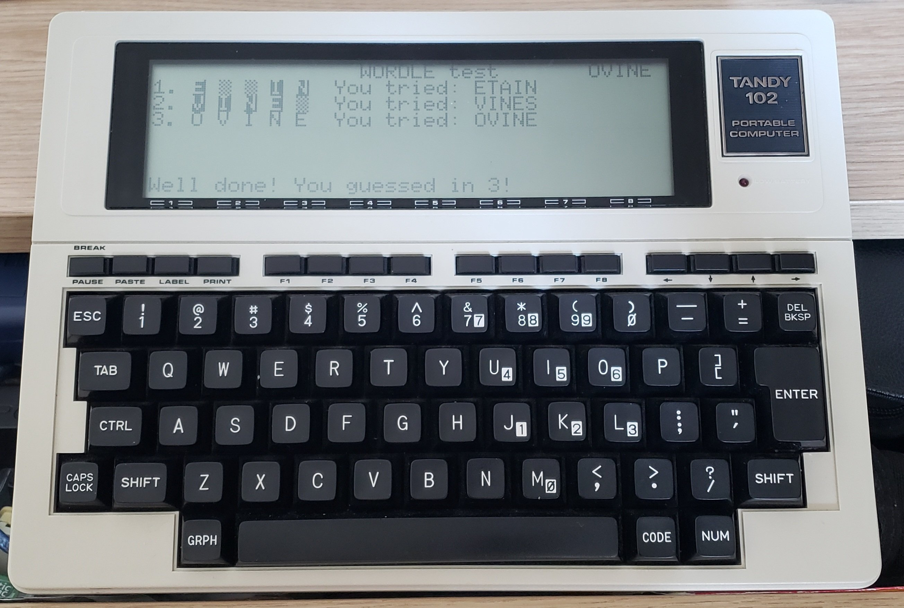

# TRS8BIT 2022 Wordle

The [TRS8BIT 2022 contest](http://trs-80.org.uk/page5.html) is a wordle implementation for any of the TRS-80 machines. There are two tracks they call "Beauty and the Beast". I went for Beauty – there's no way my T102 can fit 12,960 5-letter words, 64,800 bytes, in my 32 KB T102. Even compacted into 5-bit "letters", that's 40 KB...

But I did manage to compact things a little. The first set of words is a list of 2,313 words. I cut it down to 2,312, to fit into 289 blocks of 25 bytes, encoding 40 bytes each, ie 8 words. At the moment, the code and the dictionary take up 8,584 bytes only. There's a bug in an edge case, but even after fixing that, I should be under 9 KB...

I split the code and the dictionary, so that I could upload the dictionary once – it takes long enough...– and the code as often as needed. To do this, I created my own development environment from almost scratch. I took a simple 8085 assembler that had been long abandoned, and [modernized it](https://github.com/Kongduino/8085asm), adding compile options, the undocumented instructions, etc. It produces various files, the most important of which is the the binary, a `.co` file. This is uploaded to the T102 via a combination of a BASIC program on the T102 and a custom GUI application I made with [Xojo](https://www.xojo.com/), [`LOAD_CO`](https://github.com/Kongduino/Load_CO). It works pretty well so far, and I am quite happy with my home-grown toolchain... Among other things this toolchain enables the compilation and sideloading of apps at customized addresses in RAM, without having to calculate them: you give the compiler the `HIMEM` address (ie the lowest available address), and it calculates the `ORG` address, and the new `HIMEM`. This can then be used with `LOAD_CO`.

